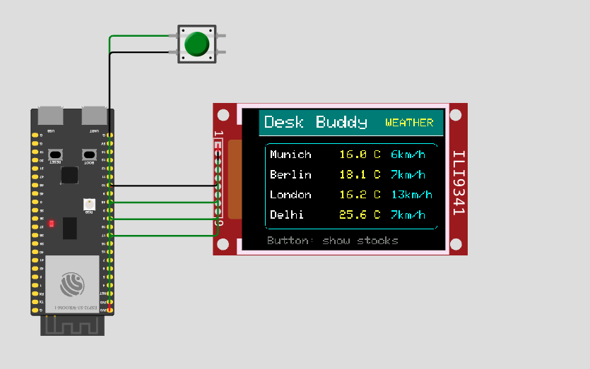
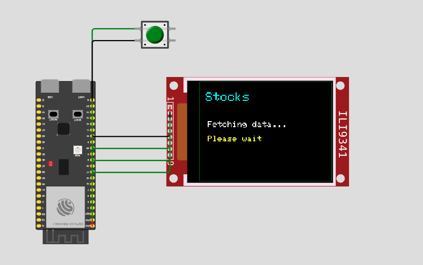
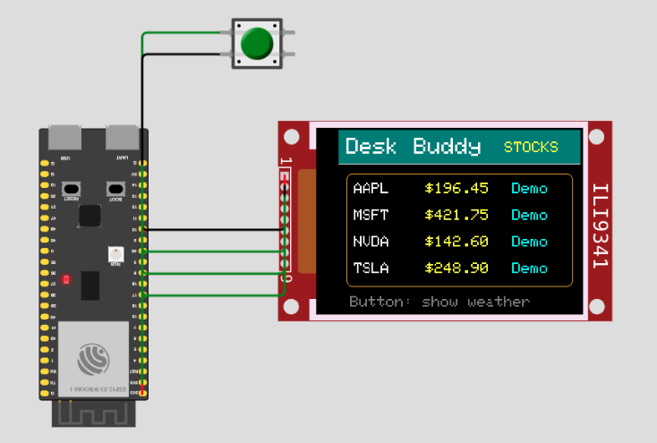

# ESP32 Desk Buddy

A small internet-connected desk companion built with ESP32, C++, Wi-Fi APIs, and an ILI9341 TFT display.

## Overview

Desk Buddy is an embedded systems project designed to sit on a desk and display useful information such as weather and stock prices.

The project was prototyped in Wokwi using an ESP32, an ILI9341 TFT display, and a push button for switching between screens.


## Demo





!!CAUTION: THE API THAT I USED FOR STOCKS HAS NOW GONE DEFUNCT, YOU SIMPLY HAVE TO REPLACE THE API-KEY, THE OVERALL STRUCTURE REMAINS SAME
## Features

- Displays weather data for multiple cities
- Displays stock data for selected companies
- Uses Wi-Fi to fetch internet data
- Uses an ILI9341 TFT display
- Button-based screen switching
- Modular code structure with separate weather and stock modules
- Wokwi simulation support

## Tech Stack

- ESP32
- C++
- Wi-Fi
- ILI9341 TFT display
- Wokwi
- Open-Meteo API
- Stooq API

## Project Files

```text
main.ino      - Main ESP32 program
weather.h       - Weather module declarations
weather.cpp     - Weather API logic
stocks.h        - Stock module declarations
stocks.cpp      - Stock API logic
